<head>
<link rel="shortcut icon" type="image/x-icon" href="favicon.ico" />
<title>SL Rad Vademecum | CASEual Wednesday - Angiomiolipoma emorragico</title>

</head>

<body>

  <a href="https://sl-rad.github.io/SL-Rad-Vademecum">Home</a>
  <a
    href="https://sl-rad.github.io/SL-Rad-Vademecum/radiologia_tradizionale.html"
    >Radiologia Tradizionale</a
  >
  <a href="https://sl-rad.github.io/SL-Rad-Vademecum/ecografia.html"
    >Ecografia</a
  >
  <a
    href="https://sl-rad.github.io/SL-Rad-Vademecum/tomografia_computerizzata.html"
    >Tomografia Computerizzata</a
  >
  <a href="https://sl-rad.github.io/SL-Rad-Vademecum/risonanza_magnetica.html"
    >Risonanza Magnetica</a
  >
  <a href="https://sl-rad.github.io/SL-Rad-Vademecum/pronto_soccorso.html"
    >Pronto Soccorso</a
  >
  <a href="https://sl-rad.github.io/SL-Rad-Vademecum/contatti.html"
    >Telefoni</a
  >

<h1>Angiomiolipoma EMORRAGICO</h1>

<!-- Slideshow container -->

  <!-- Full-width images with number and caption text -->
  

    
1 / 20

    
    

  

  

    
2 / 20

    
    

  

  

    
3 / 20

    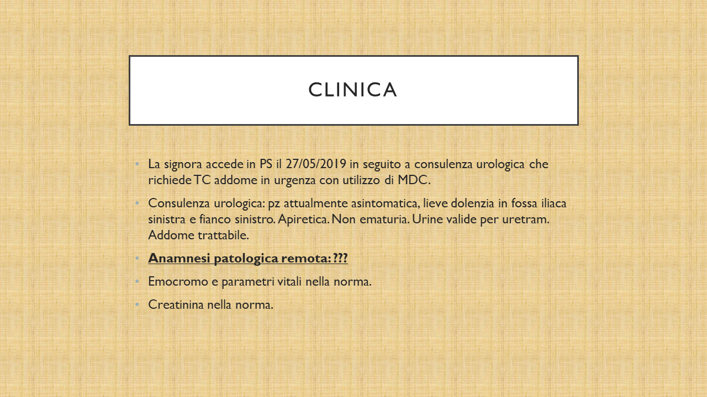
    

  

  

    
4 / 20

    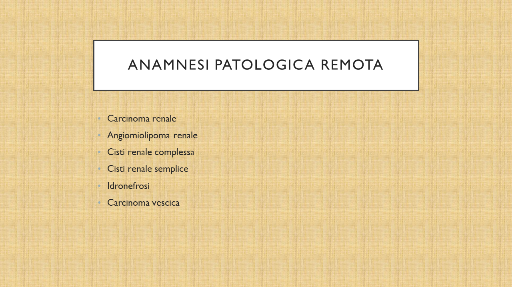
    

  

  

    
5 / 20

    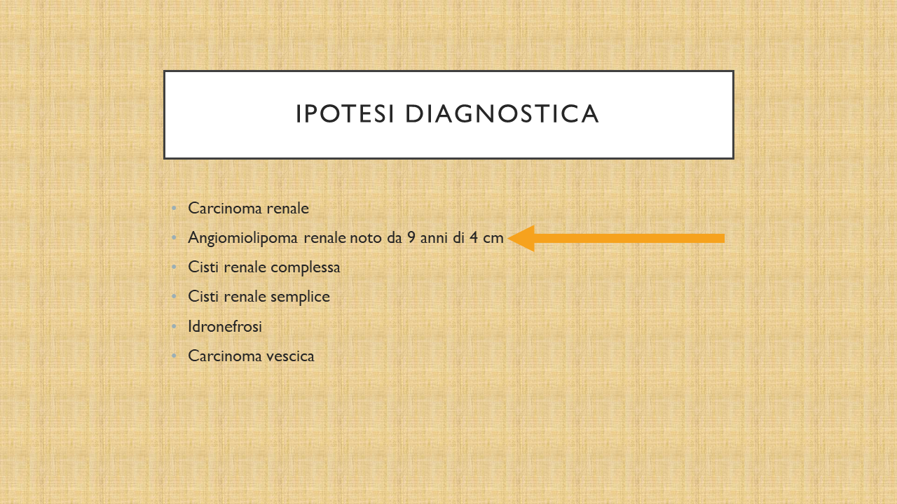
    

  

  

    
6 / 20

    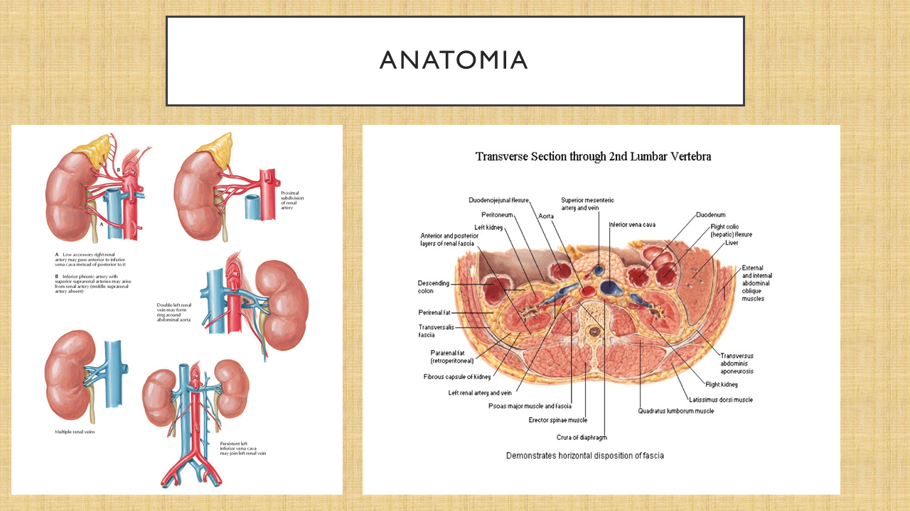
    

  

  

    
7 / 20

    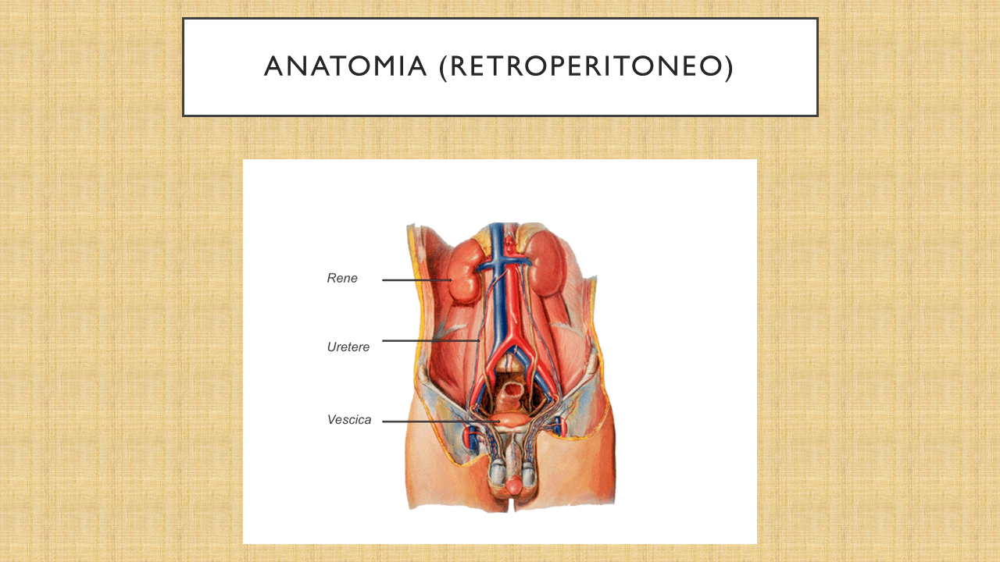
    

  

  

    
8 / 20

    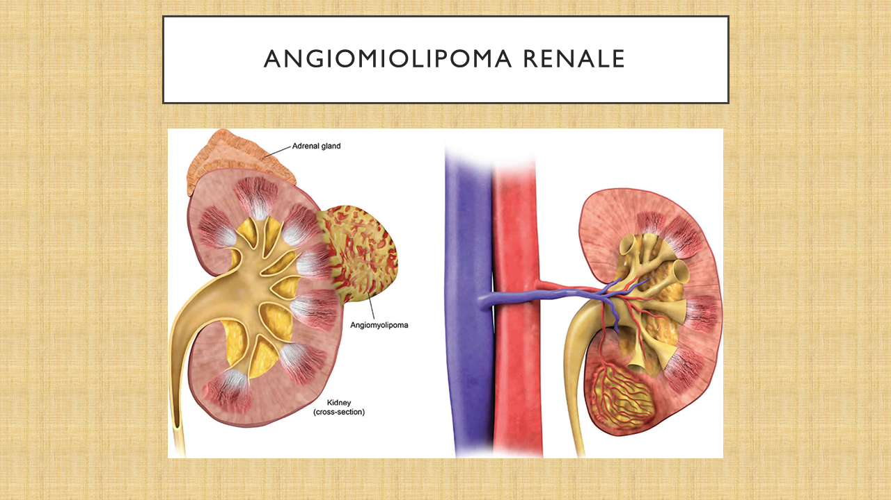
    

  

  

    
9 / 20

    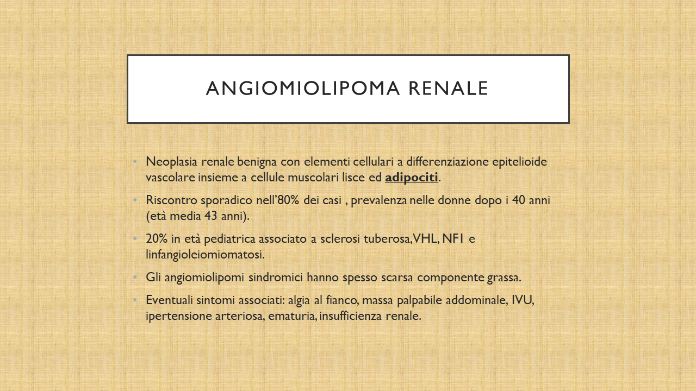
    

  

  

    
10 / 20

    
    

  

  

    
11 / 20

    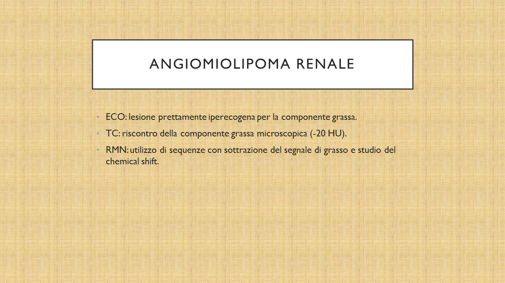
    

  

  

    
12 / 20

    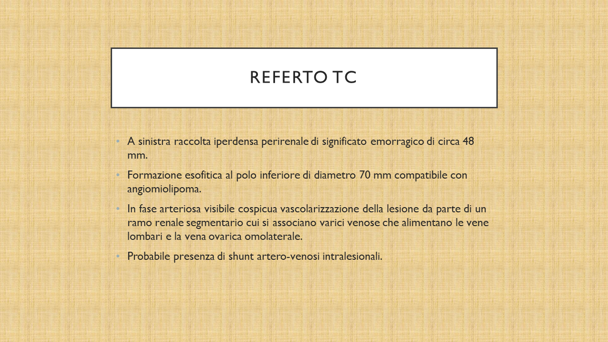
    

  

  

    
13 / 20

    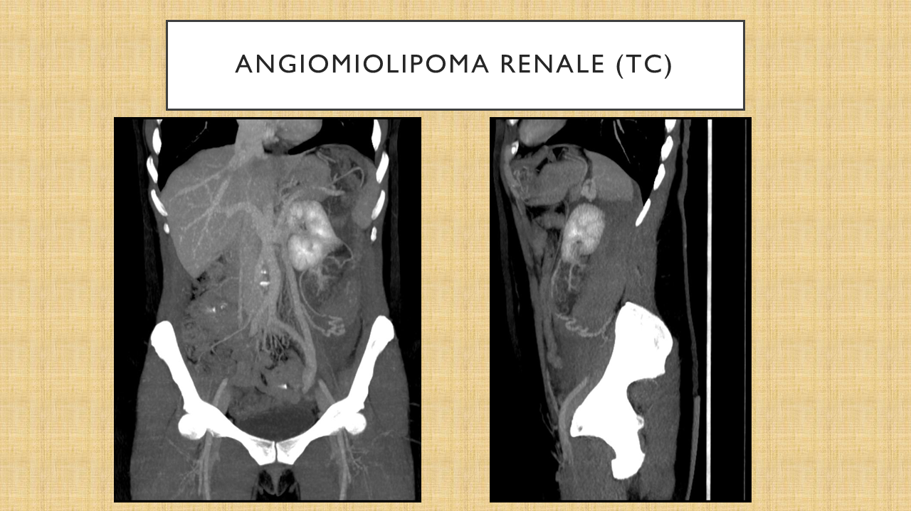
    

  

  

    
14 / 20

    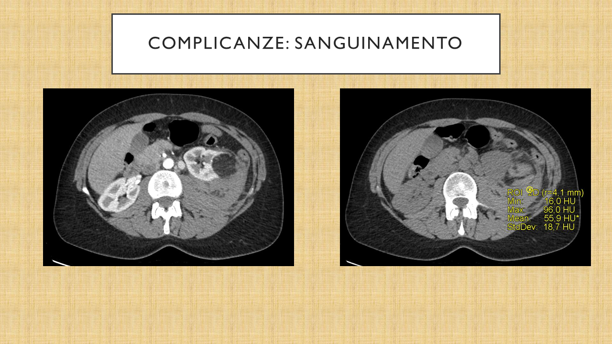
    

  

  

    
15 / 20

    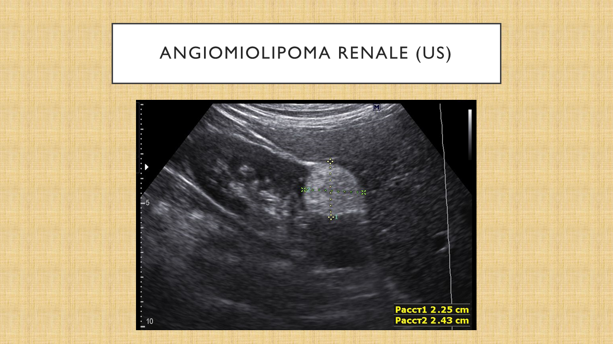
    

  

  

    
16 / 20

    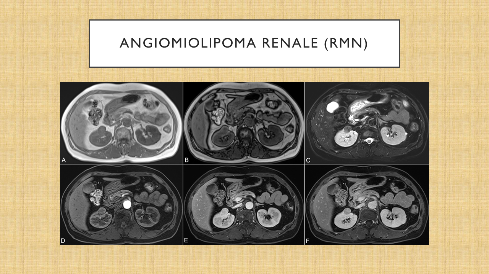
    

  

  

    
17 / 20

    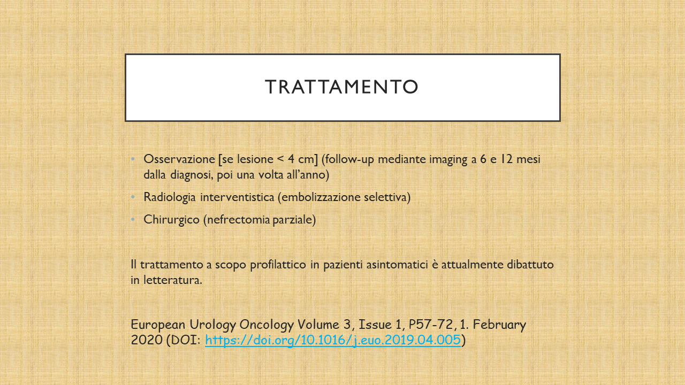
    

  

  

    
18 / 20

    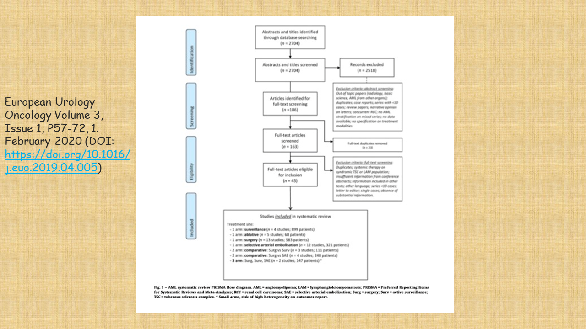
    

  

  

    
19 / 20

    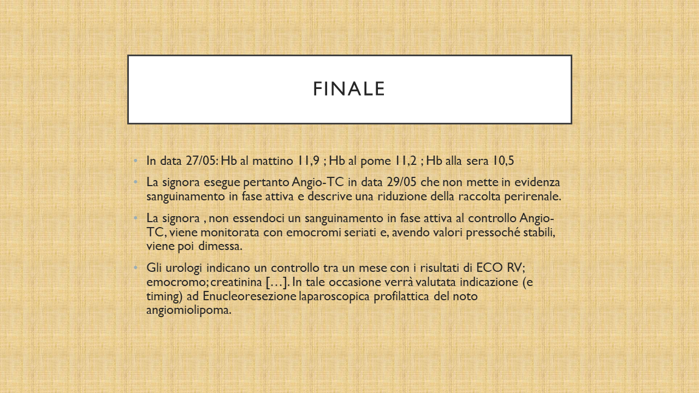
    

  

  

    
20 / 20

    
    

  

  <!-- Next and previous buttons -->
  <a class="prev" onclick="plusSlides(-1)">&#10094;</a>
  <a class="next" onclick="plusSlides(1)">&#10095;</a>

 

<!-- The dots/circles -->

  
  
  
  
  
  
  
  
  
  
  
  
  
  
  
  
  
  
  
  

<h2>ALLEGATI</h2>

<h2> BIBLIOGRAFIA </h2>

European Urology Oncology Volume 3, Issue 1, P57-72, 1. February 2020  (DOI: https://doi.org/10.1016/j.euo.2019.04.005)

</body>
