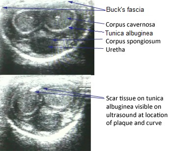

  <a href="https://sl-rad.github.io/SL-Rad-Vademecum">Home</a>
  <a href="https://sl-rad.github.io/SL-Rad-Vademecum/radiologia_tradizionale.html">Radiologia Tradizionale</a>
  <a href="https://sl-rad.github.io/SL-Rad-Vademecum/ecografia.html">Ecografia</a>
  <a href="https://sl-rad.github.io/SL-Rad-Vademecum/tomografia_computerizzata.html">Tomografia Computerizzata</a>
  <a href="https://sl-rad.github.io/SL-Rad-Vademecum/risonanza_magnetica.html">Risonanza Magnetica</a>
  <a href="https://sl-rad.github.io/SL-Rad-Vademecum/pronto_soccorso.html">Pronto Soccorso</a>
  <a href="https://sl-rad.github.io/SL-Rad-Vademecum/contatti.html">Telefoni</a>

---

# ECOGRAFIA PENIENA

L'ecografia peniena è un esame specialistico che risponde a quesiti diagnostici mirati per i quali è neccessaria una buona anamnesi.
Se la richiesta proviene da un medico non specialista questo potrebbe rappresentare un indicatore predittivo negativo.

---

- [ECOGRAFIA PENIENA](#ecografia-peniena)
	- [INDICAZIONI & LINEE GUIDA](#indicazioni--linee-guida)
	- [CONTROINDICAZIONI ASSOLUTE E RELATIVE](#controindicazioni-assolute-e-relative)
	- [ESECUZIONE DELL'ESAME](#esecuzione-dellesame)
		- [ANAMNESI](#anamnesi)
		- [TECNICA ECOGRAFICA](#tecnica-ecografica)
		- [CAVEAT](#caveat)
	- [FLOWCHART REFERTAZIONE](#flowchart-refertazione)
		- [PITFALLS](#pitfalls)
	- [CHECKLIST](#checklist)
	- [PATOLOGIE](#patologie)
		- [PLACCHE FIBROSE DEL PENE (INDURATIO PENIS PLASTICA | SINDROME DI PEYRONIE)](#placche-fibrose-del-pene-induratio-penis-plastica--sindrome-di-peyronie)
			- [EZIOLOGIA](#eziologia)
			- [REPERTI ECOGRAFICI](#reperti-ecografici)
		- [STENOSI DELL'URETRA](#stenosi-delluretra)
	- [REFERTI PREFATTI](#referti-prefatti)
		- [ECOGRAFIA PENIENA NEGATIVA](#ecografia-peniena-negativa)

---

## INDICAZIONI & LINEE GUIDA
L'ecografia del pene trova poche indicazioni e nello specifico quella principale è la ricerca di eventuali placche responsabili di assimetrie del pene in erezione.

Senza l'ausilio farmacologico (papaverina?) è possibie vautare soltanto la parte arteriosa.
<!---Indagare quali farmaci-->

Arterie:
- 2 arterie cavernose
- 2 arterie dorsali

## CONTROINDICAZIONI ASSOLUTE E RELATIVE

---

## ESECUZIONE DELL'ESAME

### ANAMNESI
- Per quale motivo svolge l'esame (Quesito diagnostico)?
- Chi lo ha richiesto (Medico generico / specialista)?
- 

### TECNICA ECOGRAFICA
Il paziente si colloca sul lettino supino con pantaloni e slip abassati, gi viene richiesto di afferare la punta del pene e di portarlo rivolto verso l'alto adagiato sull'addome.

Si passa la sonda rivolta in sezione trasversale dove si visulizzano:
- i due corpi cavernosi circondati dalla tunica albuginea con al centro le rispettive arterie cavernose
- il corpo spongioso dove al centro si intravede l'uretra
  - non è possibile valutare precisamente il lume dell'uretra all'esame ecografico

### CAVEAT

---

## FLOWCHART REFERTAZIONE
### PITFALLS

## CHECKLIST

---

## PATOLOGIE
### PLACCHE FIBROSE DEL PENE (INDURATIO PENIS PLASTICA | SINDROME DI PEYRONIE)
La malattia di Peyronie è un disturbo del tessuto connettivo che comporta la crescita di placche fibrose nel tessuto molle del pene. 

In particolare, il tessuto cicatriziale si forma nella tunica albuginea, la spessa guaina di tessuto che circonda i corpi cavernosi, causando dolore, curvatura anomala, disfunzione erettile, rientranza, perdita di circonferenza e accorciamento.

Si stima che colpisca circa il 10% degli uomini indipendentemente dall'etnia e diventa più comune con l'aumetare dell'età,

Un certo grado di curvatura del pene è considerato normale, in quanto molti uomini nascono con questa condizione benigna, comunemente indicata come curvatura congenita. 

La malattia può causare dolore; lesioni indurite, grandi, simili a corde (tessuto cicatriziale noto come "placche"); o curvatura anomala del pene quando è eretto a causa di un'infiammazione cronica della tunica albuginea (CITA).

Anche se tipicamente si immagina che la malattia di Peyronie è che essa comporti sempre una curvatura del pene, il tessuto cicatriziale a volte provoca delle rientranze piuttosto che una curvatura. 

La condizione può anche rendere il rapporto sessuale doloroso e/o difficile.

Il disturbo è limitato al pene, anche se un numero considerevole di uomini con la Peyronie presenta disturbi concomitanti del tessuto connettivo nella mano e, in misura minore, nei piedi. 

Circa il 30% degli uomini con la malattia di Peyronie sviluppa fibrosi in altri tessuti elastici del corpo, come la mano o il piede, compresa la contrattura di Dupuytren della mano. 

Una maggiore incidenza nei maschi geneticamente imparentati suggerisce una componente genetica.

Il tessuto cicatriziale responsabile delle deformità caratteristiche della malattia di Peyronie è localizzato nella regione di curvatura o restringimento.

L'ecografia permette di differenziare la malattia di Peyronie da una curvatura congenita.

#### EZIOLOGIA
La causa alla base della malattia di Peyronie è sconosciuta. 

Anche se è probabile che sia dovuta ad un accumulo di placca all'interno del pene a causa di ripetuti traumi sessuali lievi o lesioni durante il rapporto sessuale o l'attività fisica.

I fattori di rischio includono il diabete mellito, la contrattura di Dupuytren, la fibromatosi plantare, il trauma penieno, il fumo, il consumo eccessivo di alcol, la predisposizione genetica.

#### REPERTI ECOGRAFICI
Le placche fibrotiche si presentano come ispessimenti iperecogeni della placca albuginea tipicamente localizzate nella regione dorsale(possono anche localizzarsi in regione ventrale, laterale o a livello del setto).

In alcuni casi possono essere calcifiche ed in tal caso avranno un'immagine marcatamente iperecogena associata a cono d'ombra posteriore.

Nelle fasi più precoci della malattia (fibrosi ancora lieve), le lesioni si possono presentare come sia come ipoecogene associate ad un'ispessimento focale dei tessuti paracavernosi o della tunica albuginea o come formazioni focali isoecogene retrattili con attenuazione posteriore del fascio, e perdita focale della continuità della tunica albuginea.

Alla valutazione ECD l'aumento del flusso intorno alle placche suggerisce la presenza di attività infiammatoria a livello della placca mentre l'assenza di flusso suggerisce la stabilità della malattia.

### STENOSI DELL'URETRA
Una eventuale stenosi uretrale è difficilmente valutabile in ecografia.
Nel caso di sospetto clinico è necessario ricercare in anamensi un'eventuale presenza di difficoltà ad iniziare la minzione con possibile dolore nelle prime fasi.
Il paziente deve essere valutato da uno speciaista urologo ed eseguire una flussimetria.
Per visualizzare radiologicamente la stenosi è possibile eseguire una uretrografia retrograda che espone il paziente a radiazioni ionizzanti ed sarebbe quindi da evitare pazienti giovani.

---

## REFERTI PREFATTI

### ECOGRAFIA PENIENA NEGATIVA
Non evidenziabili anomali ispessimenti delle fasce peniene, né alterazioni della vascolarizzazione (con i limiti della metodica ecografica e dell'assenza di erezione).

Corpi cavernosi e corpo spongioso dell'uretra di regolare morfologia ed ecostruttura. 

